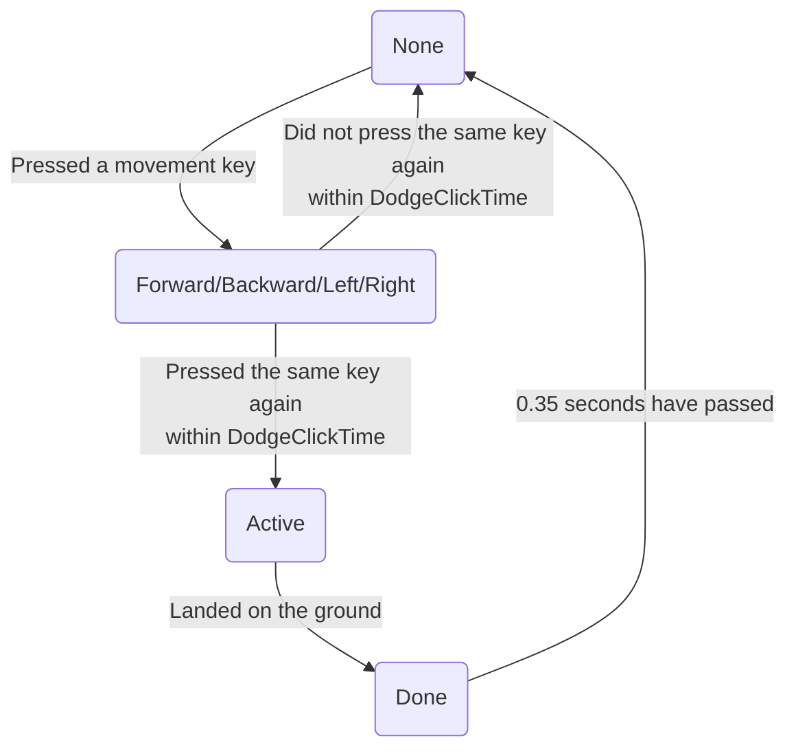

# Dodge Block

## Dodging, under the hood
To understand how UT99 handles the dodge mechanic, we need to understand which variables are involved and how they relate to eachother.

*DodgeClickTime* is a static variable which represents the maximum time interval between two consecutive key presses that result in a dodge. By default it's set to 0.25 seconds.

*DeltaTime* is the amount of time in seconds that has passed since the previous game tick. This value depends on the FPS you're running the game on. For example, if you're running the game on 60FPS the time between each tick will be 1/60 = 0.016 seconds. This value is static, assuming you don't change your FPS in-game.

*DodgeClickTimer* is NOT a static variable, but is a float used for two purposes:
- To time the amount of time that has passed since you've pressed a movement key. If the 2nd key press is within *DodgeClickTime*, you dodge.
- To time the amount of time that has passed after you've completed a dodge. For the dodge block functionality.

*DodgeDir* is a variable which represents the dodge state that the player is in. This is an enum, and can have the following values:
- Forward/Backward/Right/Left
    - The player has pressed either the forward, backward, right or left key.
    - When in this state *DodgeClickTimer* is substracted by *DeltaTime* each tick.
    - As long as *DodgeClickTimer* > 0 the player stays in this state.
- Active
    - The player is dodging, so actually flying through air.
- Done
    - The player has finished dodging, but is blocked from dodging again.
    - The player enters this state once the dodge is over, and thus has landed. *DodgeClickTimer* is set to 0.
    - When in this state *DodgeClickTimer* is substracted by *DeltaTime* each tick.
    - The player stays in this state as long as *DodgeClickTimer* > [-0.35](https://github.com/mbovijn/UT99/blob/master/Engine/PlayerPawn.uc#L4254)
- None: the value when none of the other values apply, basically when nothing related to a dodge is going on.

State diagram:


## Example of a dodge
Assumptions:
- DodgeClickTime = 0.25
- DeltaTime = 0.05

|Tick           |T00 |T01 |T02    |T03    |T04    |T05   |T06   |T07   |T08 |T09  |T10  |T11  |T12  |T13  |T14  |T15  |T16 |T17 |
|---------------|----|----|-------|-------|-------|------|------|------|----|-----|-----|-----|-----|-----|-----|-----|----|----|
|DodgeDir       |None|None|Forward|Forward|Forward|Active|Active|Active|Done|Done |Done |Done |Done |Done |Done |Done |None|None|
|DodgeClickTimer|0.25|0.25|0.20   |0.15   |0.10   |0.10  |0.10  |0.10  |0.00|-0.05|-0.10|-0.15|-0.20|-0.25|-0.30|-0.35|0.25|0.25|

- T02 = First forward key press. If the 2nd key press occurs within 0.25 seconds we have a dodge.
- T05 = Second forward key press occurred after 0.15 seconds.
- T08 = The dodge completed, a.k.a the player landed on the floor.
- T16 = The player can dodge again.

## Dodge block duration increases with ping!
When a player has a high ping, the position of the player on the server and the client will be out-of-sync more often. When that happens, the server can send a correction to the client. I'm not super familiar with how this works, but I do know that this correction can result in the N last movements being re-played, albeit with some different parameters.

By logging some variables each tick, we can gain some valuable insights. This data was obtained by running a UT server on my local machine, and by playing on that server with the same machine.
```
DodgeDir, DodgeClickTimer, DeltaTime, CumulativeDeltaTime
DODGE_Done, 0.000000, 0.008263, 0.000000
DODGE_Done, -0.008649, 0.008649, 0.008263
DODGE_Done, -0.017108, 0.008460, 0.016912
...
DODGE_Done, -0.326646, 0.008256, 0.326653
DODGE_Done, -0.335303, 0.008658, 0.334909
DODGE_Done, -0.343570, 0.008266, 0.343566
```
Here you can see that *DodgeClickTimer* and *CumulativeDeltaTime* are equal. We're blocked from dodging for 0.35 seconds, as it should be.

Now we perform the same test again, but we introduce some artifical lag in the packets, effectively simulating a high ping. This was done using a tool called [Clumsy](https://jagt.github.io/clumsy/).
```
DodgeDir, DodgeClickTimer, DeltaTime, CumulativeDeltaTime
DODGE_Done, 0.000000, 0.008811, 0.000000
DODGE_Done, -0.008738, 0.008738, 0.008811
DODGE_Done, -0.017502, 0.008765, 0.017549
...
DODGE_Done, -0.070120, 0.008761, 0.070170
DODGE_Done, -0.078916, 0.008796, 0.078931
DODGE_Done, -0.087924, 0.009008, 0.087727
DODGE_Done, -0.008633, 0.008633, 0.096735 // DodgeClickTimer was reset during this tick!
DODGE_Done, -0.017439, 0.008806, 0.105368
DODGE_Done, -0.026389, 0.008950, 0.114174
DODGE_Done, -0.035160, 0.008771, 0.123124
...
DODGE_Done, -0.325455, 0.008667, 0.413523
DODGE_Done, -0.334295, 0.008841, 0.422190
DODGE_Done, -0.343457, 0.009162, 0.431030
```
As you can see *DodgeClickTimer* and *CumulativeDeltaTime* don't match up anymore. We were blocked from dodging for a total of 0.43 seconds. So why did this happen? Normally, when the *DodgeDir* variable equals DODGE_Done, the *DodgeClickTimer* variable should be substracted by *DeltaTime*. There's a single tick where this does not happen! *DodgeClickTimer* goes from -0.087924 to -0.008633, while it should have gone from -0.008633 to -0.096557.


So why did that happen? Let's repeat the same test again but start up UT with the `-utrace` switch. This logs all the Uscript functions that are called.
```
ScriptLog: DODGE_Done, -0.108449, 0.017699, 0.100025
...
UTrace: BEGIN TMale20 Engine.PlayerPawn.PlayerWalking.PlayerTick
UTrace:   BEGIN TMale20 Engine.PlayerPawn.ClientUpdatePosition
UTrace:     ...
UTrace:     BEGIN TMale20 Engine.PlayerPawn.ClientReplayMove
UTrace:       BEGIN TMale20 Engine.PlayerPawn.MoveAutonomous
UTrace:         BEGIN TMale20 Engine.PlayerPawn.HandleWalking
UTrace:         END   TMale20 Engine.PlayerPawn.HandleWalking
UTrace:         BEGIN TMale20 Engine.PlayerPawn.PlayerWalking.ProcessMove
UTrace:         END   TMale20 Engine.PlayerPawn.PlayerWalking.ProcessMove
UTrace:         BEGIN TMale20 Engine.PlayerPawn.PlayerWalking.Landed
UTrace:           BEGIN TMale20 Engine.PlayerPawn.Landed
UTrace:           END   TMale20 Engine.PlayerPawn.Landed
UTrace:         END   TMale20 Engine.PlayerPawn.PlayerWalking.Landed
UTrace:         BEGIN TMale20 Engine.Pawn.BaseChange
UTrace:         END   TMale20 Engine.Pawn.BaseChange
UTrace:       END   TMale20 Engine.PlayerPawn.MoveAutonomous
UTrace:     END   TMale20 Engine.PlayerPawn.ClientReplayMove
UTrace:     ...
UTrace:   END   TMale20 Engine.PlayerPawn.PlayerWalking.PlayerMove
UTrace: END   TMale20 Engine.PlayerPawn.PlayerWalking.PlayerTick
...
ScriptLog: DODGE_Done, -0.010775, 0.010775, 0.117724
```
Here you can see that a call to the function 'Engine.PlayerPawn.ClientUpdatePosition' was made. This happens when the position of the player on the server is out-of-sync with the position of the player on the client. The server then corrects the position on the client, and the 'Engine.PlayerPawn.ClientUpdatePosition' function is called. As far as I know, this means that the last N movements get replayed again (albeit with some different parameters). One of those movements is the one of the player landing on the ground, after having dodged, hence the call to the function '[Engine.PlayerPawn.PlayerWalking.Landed](https://github.com/mbovijn/UT99/blob/master/Engine/PlayerPawn.uc#L4074)'. That function sets *DodgeClickTimer* to 0, which as far as I'm concerned shouldn't happen when replaying a movement. Perhaps this can be fixed in a future patch of UT99.

In the meantime I've fixed this myself in the [BTPog](https://github.com/mbovijn/BTPog/#ZeroPing-module) ServerActor.
